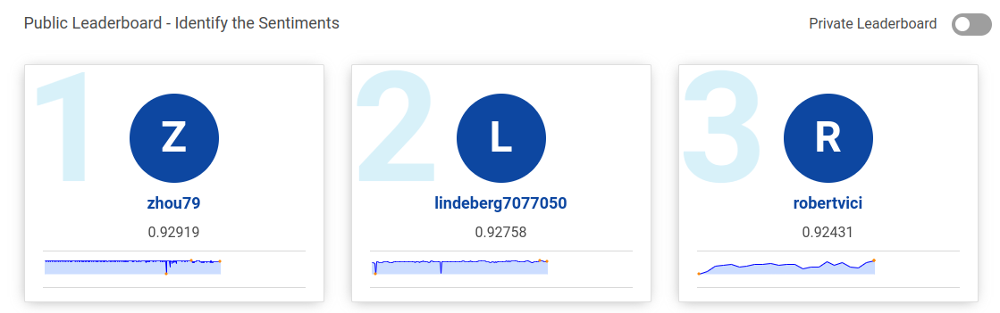

My solution to solve a simple practice NLP classification challenge on Analytics Vidhya's website - [Identify the Sentiments](https://datahack.analyticsvidhya.com/contest/linguipedia-codefest-natural-language-processing-1/). Out of 8279 participants, this solution is currently ranked in the second position.

## Problem statement - 
Sentiment analysis remains one of the key problems that has seen extensive application of natural language processing. This time around, given the tweets from customers about various tech firms who manufacture and sell mobiles, computers, laptops, etc, the task is to identify if the tweets have a negative sentiment towards such companies or products.

## Dataset
The train set contains 7,920 tweets
The test set contains 1,953 tweets

## Approach

1) XLNet (xlnet.ipynb)

2) Bert (bert.ipynb)

3) Roberta (roberta.ipynb)

4) Take model ouput predictions probability from 1, 2 & 3 and average it to create an ensemble. Achieved 0.927 (ensemble.ipynb)

###

